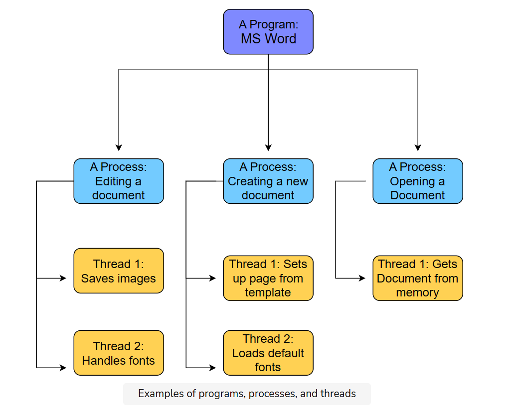
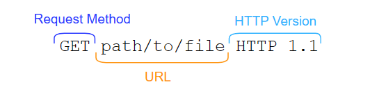
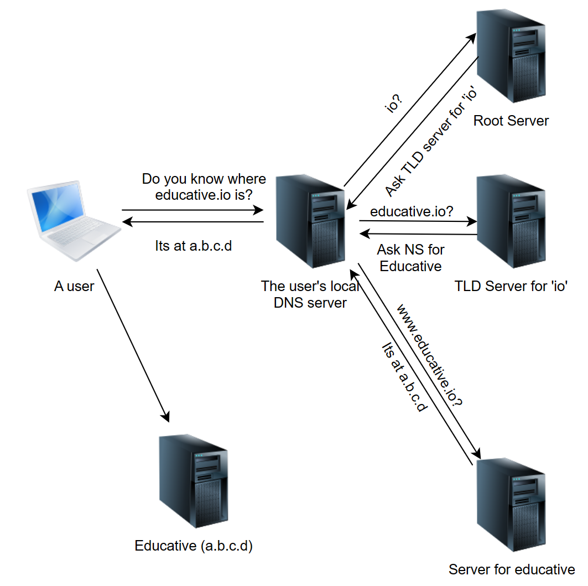
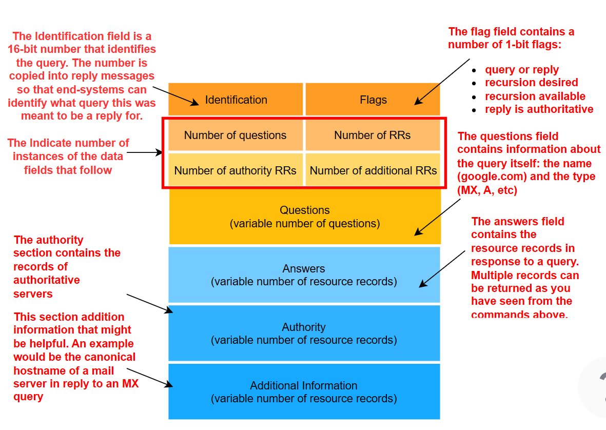

# Application Layer

## Responsibilities -
- Writing data off to the network
- Reading data from the end-user
- Providing userful application to the end user
- Error handling and recovery
- Eqivalent - Carrying the package to the post office.
- Resides on end-systems.

## Application Layer Protocols
- User apps are the purpose of the internet
- Started with emails
- Instant messaging, Voice over IP, Video Chat, Video Streaming
- Running on Application Layer Protocols

## Network Application Architecture
- How are applications structured across end systems?

### Client-Server Architecture
- App split into 2 - Client-side software, and server-side software (called processes)
- Communicate with each other via messages
1. Server - 
    - Controls access to a centralised resource or service (Website)
    - 2 important characteristics -
        - Attempt made to keep servers online all the time
        - Have atleast one reliable IP by which they can be reached
    - Equivalent - 24/7 Pizza Delivery Place
    - Scaled up - Several machines host server processes, and reside in **data centers** (buildings that house servers)
2. Client - 
    - Use the internet to consume content and use services
    - Initiate connection to the servers

### P2P Architecture
- No dedicated server is involved - Apps communicate with each other
- Each peer can be categorised as servers or clients - Every machine is capable of being a client as well as a server
- Eg. Bittorrent - Based on P2P. User accesses bits of the file on several other users’ computers and puts them together on its end. No traditional ‘server’ is involved in this scenario.
- Filesharing is not the only application of P2P!

### Hybrid
- Involving server involvement to some extent
- Combination of the two architectures.

## P2P vs Client-Server
- Server can upload at rate $up_s$ (upload speed in bits/second)
- $N$ clients want to download the same file from the server.
- Client $i$ can upload/download at rate $up_i/dwn_i$ bits/second
- Size of the file - $S$

Client: Can download/upload the file at a certain rate
Server: Can upload the file at a certain rate to the client.

### Client-Server
- Server can upload to $N$ clients in time $NS/up_s$
- Client will take at least $S/dwn_{min}$ time to download the file, where $dwn_{min} = min(dwn_i)$
$$max\{{\frac{NS}{up_s}, \frac{S}{dwn_{min}}}\}$$

### P2P
- Server can upload to 1 clients in time $S/up_s$
- 1 client will take at least $S/dwn_{min}$ time to download the file, where $dwn_{min} = min(dwn_i)$
- To upload across N clients, it will take $NS/{up_{sum}}$ where  $up_{sum} = \sum{up_i}$
$$max\{{\frac{S}{up_s}, \frac{S}{dwn_{min}}}, \frac{NS}{up_{sum}}\}$$
- P2P is incredibly scalable! Self-scaling


## How Processes Communicate

### Program vs Process vs Thread
- Program: An executable file. Eg. MS Word
- Process: Any currently running instance of a program. Eg. Multiple windows open.
- Thread: A lightweight process. One process can have multiple threads running. Threads do lightweight, singular jobs.



### Sockets
- Processes on different machines send messages to each other through the computer network. Software interface is called a **Socket**. 
- Processes (Message)> Socket
- Socket is a combination of IP Address + Port Number

### Addressing
- Messages have to be addressed to a certain application on a certain end system. How?

IP Addresses and Ports.

**Ports** - Used to address the packet to specific applications. Some ports are reserved - 80 for HTTP, 443 for HTTPS.
- Each application has a different port number, like each apartment has a different apartment number.
- The all share the IP address of the end system.
- Servers can use **ephemeral ports** in case there are several instances of an application running all at once on the reserved ports - These are dynamically generated.

## HTTP - Basics

### Objects
- Object is a file (HTML file, PNG file, MP3 file, TXT file).
- Each object has a URL.
- Base object of a web page - HTML file, that has references to other objects, by making requests for them via the URL.

*URL breakdown -* 


- HTTP Request - The request made by the client to the server
- HTTP Response - The response sent from the server to the client
- HTTP is stateless - i.e. it does not store any information about clients by default.

### HTTP Requires Lower Layer Reliability
- Relies on underlying transport protocols - **UDP** (User Datagram Protocol) and **TCP** (Transmission Control Protocol)
- TCP/UDP does/does not ensure that messages are always delivered.
- TCP is connection-oriented.

### HTTP Connections 

1. Persistent
    - Use one TCP connection session for multiple requests
    - Server closes the connection if no requests are made for a while.

2. Non-Persistent
    - Use one TCP connection per request


## HTTP - Request Messages

```
GET /path/to/file/index.html HTTP/1.1 # Request Line
Host: www.educative.io # Header Line (from here to end of request)
Connection: close # Persistent or Non-Persistent
User-agent: Mozilla/5.0
Accept-language: fr
Accept: text/html
```

### Request Line


### HTTP Methods
- GET - Request data
- POST - Put an object on the server
- PUT - Upload an entity under a supplied URL.
- HEAD - Similar to GET, but the resource is not sent - The HTTP header is.
- DELETE - Delete object

### URLs vs URIs
- **Uniform Resource Locators (URLs)** are used to identify an object over the web. RFC 2396. A URL has the following format: ```protocol://hostname:port/path-and-file-name```
- **Uniform Resource Identifiers (URIs)** are more specific, can locate fragments within objects too RFC 3986. A URI has the following format: ```protocol://host:port/path?request-parameters#nameAnchor```. For instance, https://www.educative.io/collection/page/10370001/6105520698032128/6460983855808512/#http-methods is a URI.

## HTTP - Response Messages
```
HTTP/1.1 200 OK # Status Line
Connection: close # Header Lines from here to below
Date: Tue, 18 Aug 2015 15: 44 : 04 GMT
Server: Apache/2.2.3 (CentOS)
Last-Modified: Tue, 18 Aug 2015 15:11:03 GMT 
Content-Length: 6821
Content-Type: text/html

[The object that was requested] # Object
```

### Status Codes
- 1xx codes fall in the informational category
- 2xx codes fall in the success category
- 3xx codes are for redirection
- 4xx is client error
- 5xx is server error

```200 OK```- Request was successful, and the result if apppended with the response

```404 File Not Found```- Requested object doesn't exist on the server

```400 Bad Request```-  Request was in a format that the server could not understand

```500 HTTP Internal Server Error```- Request could not be complemeted because the server encountered some unexpected error

```505 HTTP Version Not Supported```- Requested HTTP version is not supported by the server

**Curl**: Client URL
- ```--head``` flag or ```-I``` tells cURL to send an HTTP request with the ```head``` method.
- ```-silent``` flag tells cURL to not display the progress meter

## Cookies

- HTTP is a stateless protocol, but we see websites where session state is needed (eg. shopping online)
- Cookies allow the server to keep track
- Cookies are **unique string identifiers** stored on the client's browser.
- These identifiers are set by the server through HTTP headers when the client first navigates to the website.
- After the cookie is set, it’s sent along with subsequent HTTP requests to the same server. This allows the server to know who is contacting it and hence serve content accordingly.

- ```Set-cookie``` header (Case Sensitive)- When a server wants to set a cookie on the client-side, it includes a ```set-cookie: value``` in the HTTP response.
- Cookie is added to a special file on the client side. Contains -
    - Website's domain
    - String value of the cookie
    - Date that the cookie expires

### Dangers
- Record of what you visit, what pages, in what order.
- What if websites can track what you do on other cookies?

Example
1. A user visits amazon.com.
2. A cookie for free-stats.com is subsequently set on their browser because free-stats has placed an advertisement on Amazon (3P cookie)
3. The user visits ebay.com, and eBay also has placed an advertisement for free-stats.com.
4. The same cookie set on the Amazon site will be reused and sent to free-stats along in an HTTP request with the name of the host that the user is on.
5. Free-stats can in this way track every website the user visits that they are advertising on and create more targeted ads in order to generate greater revenue.

### Workarounds
- Respawning cookies
- Flash cookies
- Entity tags
- Canvas fingerprinting

## DNS - Basics
How do you find things on the internet? Two ways - 
- **Addresses or Locations**: Like a physical address. The addresses are IP addresses, and the routers know the map.
- **Names**: Domain names (like a person's name), or the unique name identifying a website, are mapped into IP addresses based on lookup services that use a DB. So educative.io in the search bar > DNS lookup (directory service) > IP Address of the educative.io server.

### Local DNS Cache 
- DNS mappings will often be cached at the client end-system, to avoid repetitive lookups, and saves time for often visited websites.
- Done via the Local Resolver Library, which is part of the OS. Application makes an API call to the library. This library manages the local DNS cache.
- Local DNS Server is configured on the client machine using a protocol called DHCP.
- Local DNS Servers are the first point of contact after a client checks its local cache. Hosted at the ISP, and contain some mappings based on what websites users visit.
- Your ISP has a record of all the websites you visit!



## DNS - Records and Messages

- DNS distributed DB consists of entities called **RRs**, or **Resource Records**

### Format
- Name of the domain
- RData (Resource data) - Provides information for the type of resource record
- Type of resource record
- TTL - How long the record should be cached by the client in seconds
- DNS Class - IN (Internet class)? CH (Chaos class - Querying DNS Server versions)?

### Types of resource records
- **Address** Type or **A** addresses - Ipv4 address to hostname mappings
    1. Name - Hostname (educative.io)
    2. TTL - In seconds (299)
    3. type - A (for Ipv4 RData types)
    4. RDATA - A.B.C.D
- **Canonical Name** or **CNAME** - Record of alias hostnames to actual hostname mappings
    1. Name - Hostname (ibm.com)
    2. RDATA - Alias name (servereast.backup2.com)
- **Mail Exchange** or **MX** - Records of the servers that accepts emails on behalf of a certain domain.
    1. Name - Hostname (educative.io)
    2. RDATA - Name of the mail server (aspmx2.googlemail.com)

This data is stored in text form in special files, called **zone** files.

### DNS Message - 
- The exchange between a browser and a DNS server
- In the form of a query or a response
- Zone transfer request are used by the backup or secondary DNS servers, when zone files are copied from one server to another.




