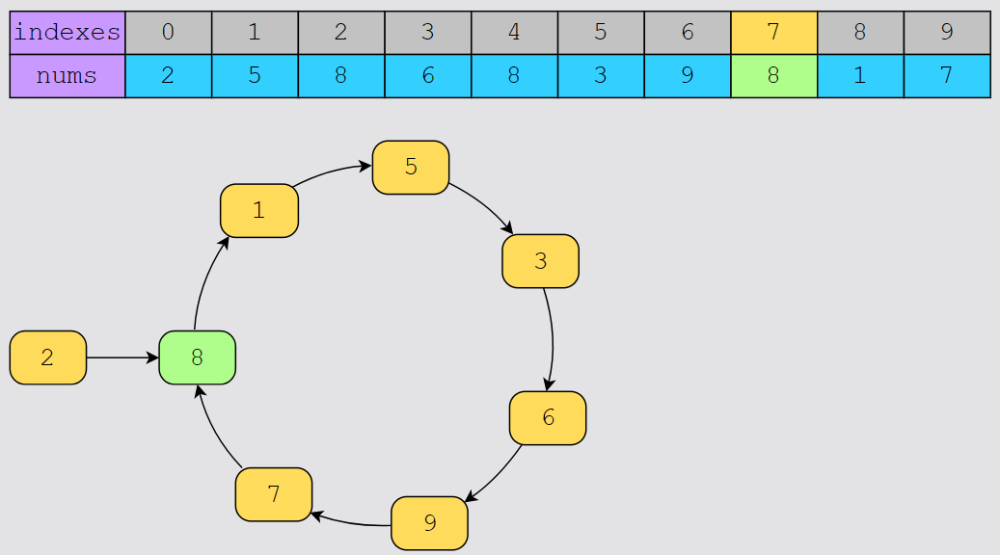

# Cyclic Sort: Introduction

- In-place, unstable, comparison sort algorithm
- Based on the insight that subsequences of numbers in the input array that are not in the sorted order actually describes cycles (group theory!!) 
- Patterns works well for numbers ranging from [1-n]. Algorithm places each element at the correct position within the array
- Cycle through the array + swap each element with the elemnt where it should be

Eg. 
1. Set mismatch - Missing number/Duplicated Number
2. Find the kth missing positive number

## Does my Problem Match this Pattern?

Yes, if both of these conditions is fulfilled-

1. Problem requires sorting the array without using any additional memory, and the numbers in the array are in the range [1,n], where 
n is the length of the array.
2. The input array can be divided into cycles.

No, if any one of these conditions is fulfilled - 

1. The input data does not contain an array with integer values.
2. The input data is not originally in an array, nor can it be mapped to an array
3. The values are not in the range [1, n]
4. Problem requires stable sorting

## Real-world problems

- Computational Biology - Find the kth missing gene in a given DNA sequence
- Data Validation - Quickly identify any missins/duplicate values
- DB operations-  During database indexing, cyclic sort can be integrated into the sorting process, faciliating efficient organisation of DB performance
- Data Analysis and Visualisation - Employed to sort and organise datasets that involve distinct categorical variables.