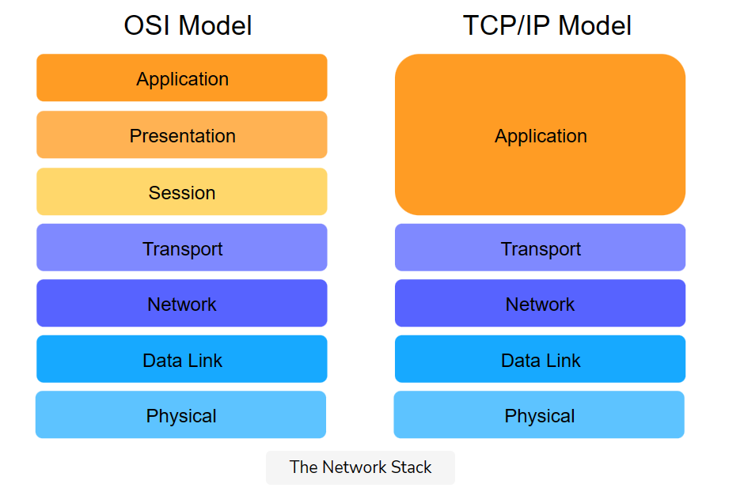

# Internet and the OSI Model

## Network
- Group of systems of interconnecte people or items (similar to a railway network or social network)
- Purpose -
    - Communication of computers
    - Sharing of resources

## Why Layered Architecture?
- Specific
- Well-defined parts of a larger system
- Easier changing of implementation level details and identifying bugs easier

## Layered Architecture
Analogy with physically delivering a mail -

### Layers As Services to Each Other: Layers Are Vertical
- Each layer provides some service to the layer above it
- The layer above is not concerned with the details of how the layer below performs its services - Abstraction
- Top-layer in the network - Application layer (end-user applications live here), include the web and email. Outgoing message starts its journey here.

### Layers Communicate with Their Parallels: Layers Are Horizontal
- Letter writer and receiver in direct communication, post offices for sender and receiver etc.
- Same in the network.

### Layers Evolve Independently
- Any lower layer in this model provides certain services that the upper layer can build other services uupon
- Eg. Going from text based emails to attachments, letters to packages, envelope or a box etc, mp3 file or word document for an application to ingest etc.

### Encapsulation and Decapsulation
- Each layer adds its own message coming from above
- Receving entity on the other end removes it.

### Commonly Used Models for organising Computer Networks
- **OSI Model**
- **Transmission Control Protocol/Internet Protocol (TCP/IP) Model**

## I. Open Systems Interconnection (OSI) Model
- Standard for different computer systems to communicate with each other.

### 1. Application Layer
- Almost always implemented in Software
- End-users interact with the application. Eg. Web browsing, Email
- Outgoing messages starts it journey here

### 2. Presentation Layer
- Presents data in a way that can be easily understood and displayed by the application layer
- Encoding - Underlying layer might use a different character encoding. This layer's job is to translate.
- Encryption - Done at this layer
- Abstracts - Assume user session maintained by the lower layers, transforms content presentation to suit the application
- E2E Compression - To reduce traffic in the network.

### 3. Session Layer
- Take the services of the transport layer and build a service on top, that manages user sessions.
- Session: Exchange of information between local applications and remote services on other end systems - Eg. one session spans a customer’s interaction with an e-commerce site whereby they search, browse and select products, then make the payment and logout.
- This layer maps messages it gets from the transportation layers to the sessions.

### 4. Transport Layer
- Protocols implemented in Software
- Segments data into smaller chunks - called Datagrams or Segments (depending on the protocol used)
- Additional information is required to transmit the segment reliably. Transport Layer adds this data.
    - Checksum - Message correctly delivered to the recipient?
    - Header - Info added to the start
    - Trailer - Info added to the end

### 5. Network Layer
- Messages here are called 'packets'
- Facilitate transport of packers from one end system to another and help determine the best route
- Routing protocols - Apps running on the network layer, exchange messages with each other to develop informaiton that helps them route transport layer messages
- Load Balancing

### 6. Data Link Layer
- Allowing directly connected hosts to communicate
- Addresses - Flow control and Error Detection/Correction.
- Encapsulates packets for transmission across a single link.
- Resolves transmission conflicts across one singular link.
- Handles addressing ff the data link is a broadcast medium
- Multiplexing & Demultiplexing:
    - Multiple data links can be multiplexed into something that appears like one, to integrate their bandwidths.
    - Likewise, sometimes we disaggregate a single data link into virtual data links which appear like separate network interfaces.

### 7. Physical Layer
- Hardware
- Electrical and mechanical medium to transmit the data
- Transmit bits.
- Deal with mechanical specifications about the makeup of the cables and design of the connectors.

## II. Transmission Control Protocol/Internet Protocol (TCP/IP) Model

- Called the Internet Protocol Suite
- Developed by DARPA (Defense Advanced Research Projects Agency)
- Details - https://datatracker.ietf.org/doc/html/rfc1122
- This model is used practically, unlike the OSI model which is more conceptual. Protocols are defined in every layer.
- Core is packet-switched, so packets are router per-hop, to circumvent failures

The End-To-End Argument in System Design
- The TCP/IP protocol suite is heavily influenced by the end-to-end argument.
= Implementing intelligence in the core was too expensive, therefore, intelligence was implemented at edge devices. So, the Internet’s design was of intelligent end devices and a dumb and fast core network.

