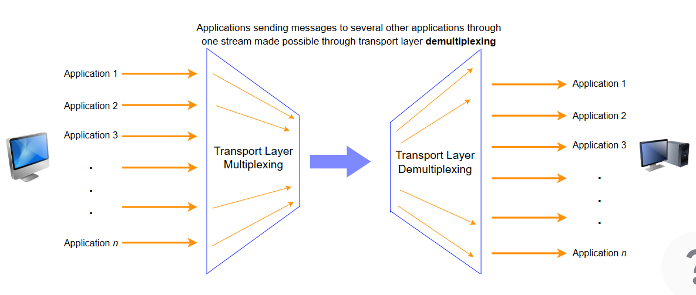

# Transport Layer

## Responsibilities
- Extends network to the applications
- Take messages from the network to the applications.
- Logical App2App delivery, across client and host machines (abstraction)
- Segment data - Divide data into manageable pieces (segments/datagrams)
- Can allow multiple conversations
- Multiplexes and demultiplexes data - If multiple applications are sent to a host, they all end up at the correct application
- Protocols reside on the end system - First layer of the OSI reference model that distinguishes between applications.

### Analogy
- The plane/ship is the network layer
- The post system delivering the message to the recipient is the transport layer.
- Network layer handles delivering the message from the client to the host machine, but the transport layer is responsible for delivering the message to the relevant application on the host machine.

## Transport Layer Protocols

### Transmission Control Protocol - TCP
> Reliable delivery of segments
> Detects modification during delivery and corrects them
> Handles the volume of traffic within the network core
> Eg. HTTP, Emails, File Transfers

### User Datagram Protocol - UDP
> Does not ensure in-order delivery of 'datagrams'
> Detects modification, does not correct them by default
> Faster than TCP because of the reduced overhead
> Eg. DNS, Live video streaming, Voice over IP

## Multiplexing and Demultiplexing

How does the transport layer handle so many simultaneous connections over one network?

- How does the end system know which application/process to deliver packets to? **Demultiplexing**

### Demultiplexing
- Deliver correct packets to the correct applications from one stream

### Multiplexing
- Allow messages to be sent to more than one destination host via a single medium

### Sockets
- If an application wants to send something to the network, it will write the message to it's socket
- They have an associated **port number** with them.
- Ports are 16 bit long, range from 0-65535
- First 1023 ports are reserved for certain applications, or well-known ports (Port 80 - HTTP)
- Layer will label packets with the port number of the application a message is from, and one it is addressed to.

## Multiplexing and Demultiplexing in UDP

- If the source port and source IP on 2 datagrams are different, but the destination port and IP addresses are the same, the datagrams will still get sent to the same application.
- Common to have the port on the client side assigned dynamically.

## Congestion Control

- Similar to traffic congestion, when you have too many packets than the network has bandwidth for, some start to get dropped and others delayed.
- How does the transport layer control congestion?
    - Sending packets at a slower rate in response to congestion
    - The slower rate is still fast enough, to make efficient use of the available capacity
    - Changes in the traffic are kept track of.

## Bandwidth Allocation Principles

### On a per Host or per Connection made by the host?

- Some hosts can send and receive data at higher data rates than others.
- You want to ensure that hosts are able to use up the full capacity of the allocated bandwidth.
- Bandwidth is allocated per connection.

### Efficiency and Power
- Bandwidth cannot be divided and allocated equally among end systems, since data travels in bursts.
- Bursts can cause more than the allocated bandwidth to be used, which results in congestion and a consequent drop of performance.

### Transmission and Threshold
- Increase in transmission rate - Rate of actural transmission rate decreases after the onsent of congestion, even if the transmission rate < capacity
- Delay in delivery increases exponentially when the packet transmission increases after a certain threshold (onset of congestion) - Zone of congestion collapse.
- Optimal transmission rate is such that the power is maximized.

$$Power = \frac{Transmission Rate}{Delay}$$

### Max-min Fairness

- Congestion control scheme should be fair
- No link in the network is congested
- Rate allocated to a source j cannot be increased without decreasing the rate allocated to another source i, whose allocation is smaller than the rate allocated to the source j
OR
- Increasing the transmission rate of one end-system necessarily decreases the transmission rate allocated to another end-system with an equal or smaller allocation.
- Optimal rate allocation is at the intersection of the efficiency line and the fairness line.

## Principles of Reliable Data Transfer

### Network Layer Imperfections

Three types of imperfections -

- Segments can be **corrupted** by transmission errors
    - Solution: Checksum - Sum of all bytes of a segment sent by the sender
- Segments can be **lost**
    - Solution: Retransmission Timer - Value is greater than the round trip time. Problem - Potential duplication of segment.
- Segments can be **reordered** or **duplicated**
    - Solution: Id/Sequence number.

## User Datagram Protocol (UDP)

- Transport layer protocol, working over the famous Internet protocol
- Connectionless protocol
- Prepends the source and destination ports to messages from the application layer, and hands it off to the network layer.

### Header

Four 2-byte header fields.
- **Source** port number
- **Destination** port number
- **Length** of the datagram
- **Checksum** to detect if errors have been introduced.

### Data

- UDP datagram contains a body of data that can be up to 65528 bytes long (2**16 - 8)
- Checksum calculation -
    - The payload and some of the headers are divided into 16 bit words
    - Words are added together, wrapping any overflow around
    - One's complement of the sum is taken and appended to the message as the checksum
    - At the receiving end, UDP sums the message in 16 bit words and adds the sum to the sent checksum
    - Result should be 1111111111111111 if the message was not corrupted

### Why UDP

- Faster
- Reliability can be built on top
- Gives finer control over what message is sent and when it is sent
- UDP allows custom protocols to be built on top

### Who uses UDP?

- XBOX
- DNS
- Network management and monitoring, done using a protocol called Simple Network Management Protocol, runs on UDP

## Transmission Control Protocol (TCP)

