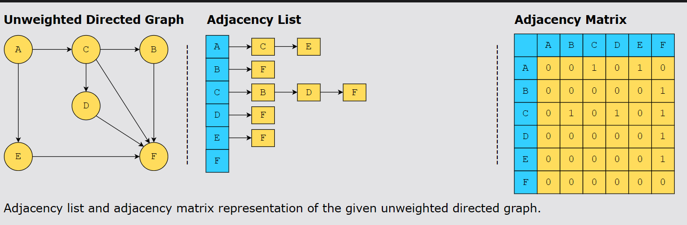
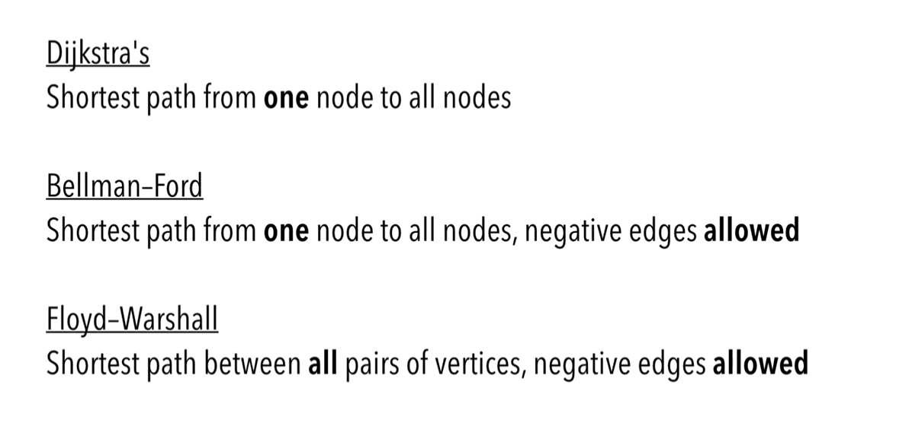

# Graphs: Introduction

- Nonlinear data structure consisting of nodes/vertices (V) and edges (E)

Types of graphs:
1. Undirected graph - Edges have no direction, the relationship between vertices is two ways
2. Directed graph - Edges have a direction, the relationship is one-way
3. Weighted graph - Graph in which each edge has a numerical weight, represented by length/cost/some other attribute
4. Cyclic graph - Contains atleast one cycle
5. Acyclic graph - Does not contain any cycles (no path starts/ends at the same vertex)

Data structure that can represent graphs:
1. Adjacency List - Collection of lists, each list represents a vertex of the graph
2. Adjacency Matrix - 2D array, each row and column representing the graphs vertices

Algorithms to solve graph problems:
1. Traversal of a graph - DFS, BFS
2. Shortest Path between two vertices - Djikstra's, Bellman-Ford, Flloyd-Warshall, BFS

3. Minimum Spanning Tree - Prim's Algorithm, Kruskal's Algorithm

## BFS and DFS

BFS: Breadth First Search
- Traverse different vertices in a breadth-first order
- Traverse the source vertex + add it to the list of vertices to visit
- Data Structure: Queue

DFS: Depth First Search
- Traverse different vertices in depth-first order
- Data Structure: Stack

Minimum Spanning Tree - 

Choice of algorithm depends on the nature of the problem:
1. BFS - Find the shortest path in an unweighted graph
2. DFS - Find a path in a maze when you want to explore vertices that are far away from the source vertex, before visiting vertices that are closer
3. Prim's Algorithm - Finds the minimum spanning tree of a weighted graph, by starting from any vertex and then iteratively adding the minimum weight edge that connects a vertex in the current tree to a vertex outside the tree [Network connectedness optimisation]
4. Djikstra's Algorithm - Find the shorted path in a weighted graph between two nodes

Eg.
1. Does a path exist between two vertices in an unweighted graph - BFS
2. Detect a cycle in a graph - DFS, mark the nodes as visited

## Does my Problem Match this Pattern?

Yes, if -

1. Input can be represented as a graph

No, if any one of these conditions is fulfilled -

1. Input cannot be represented as a graph

## Real-world problems

- Routing of IP Packets on the Internet - Internet can be modeled as a graph, where vertices are routers and edges are the connections between them. Edges can have various weights representing the cost of sending a packet from one router to another.
- Flight Route Optimisation - Airlines use graph based algorithms to optimise flight routes (vertices are airports, edges are flights between them)
- Detecting Deadlocks in Operating System Processes - Processes in the OS can be modeled as vertices in the graph - Resources they hold and need can be modeled as edges in the graph,. Cycle in the graph means that there is a set of processes waiting for each other and are in a deadlock.
