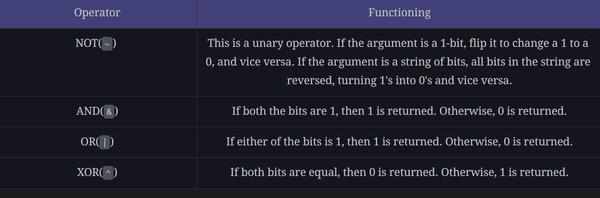

# Bitwise Manipulation: Introduction

- Modifying bits algorithmically using bitwise operations.
- Logical bitwise operations are the fastest computations, because processors natively support them.
- Leads to efficient solutions in problems where we can efficiently transform the inputs into its binary form, or manipulate directly at the bit level to produce the required output.

Eg.
1. Swap two numbers without using a temporary variable
2. Compare two strings character by character

## Does my Problem Match this Pattern?

Yes, if either of these conditions is fulfilled -

1. Input data can be manipulated at the level of the primitive bitwise logical operations, in order to compute some portion or all of the solution.
2.The input data is unsorted, and the answer seems to require sorting, but we want to do better than O(n logn)

No, if any one of these conditions is fulfilled -

1. The input data type is not in numeric form or cannot be converted to numeric form

## Real-world problems

- Bit fields (Flags) - Implement a way of representing things whose state is defined by a boolean expression
- Cryptography - Can be used to encrypt and decrypt any sensitive data
- Releasing Process Lock - Given a list of integers, they can be used to represent the order in which the lock was acquired and released in an operating system